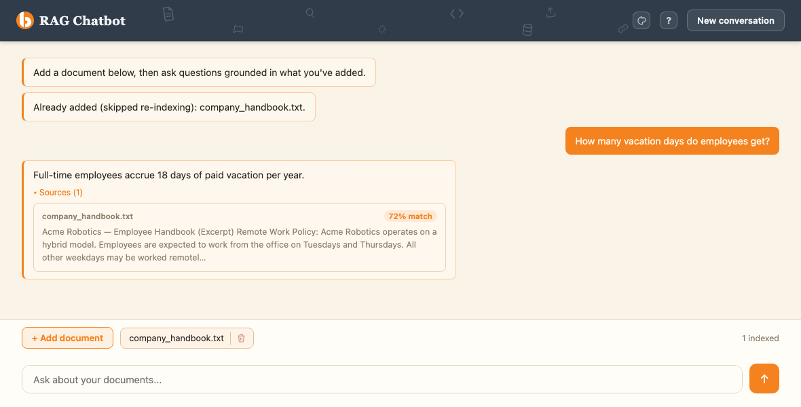

<div align="center">


# RAG Chatbot

Upload your own documents and ask questions about them — answers are grounded in
what you actually uploaded, with the exact source passages shown alongside every
reply.

**[Try the live demo →](https://rag-chatbot-4p6g.onrender.com)**
*(free tier - spins down after 15 min idle, first request after that can take ~30-60s to wake up)*

</div>

<br>



## What it does

- **Upload** `.txt`, `.md`, or `.pdf` files (drag-and-drop or the file picker).
- **Ask questions** about them in plain conversation - replies stay grounded in
  your documents rather than the model's own general knowledge, and honestly
  say "I don't have that information" when nothing relevant was uploaded.
- **See the receipts.** Every grounded answer has an expandable **Sources**
  panel showing exactly which passage it came from, which file, and how
  strong the match was - so you're never just taking the answer on faith.
- **Multiple documents, no duplicates.** Upload as many files as you like;
  re-uploading the same content (even under a different filename) is
  detected and skipped rather than indexed twice.
- **5 color themes**, a clean conversation history that persists between
  visits, and a "New conversation" button that gives you a genuinely clean
  slate (chat + documents both cleared).

## How it works

```
upload → extract text → chunk → embed (Gemini) → store (Supabase/pgvector)
                                                        ↓
your question → embed → similarity search → relevant chunks → grounded answer (Gemini)
```

Built with **Python + FastAPI** on the backend, **LangChain + Google Gemini**
for chat and embeddings, **Supabase (Postgres + pgvector)** as the vector
store, and a **vanilla HTML/CSS/JS** frontend - no frontend framework, no
build step. Deployed on **Render**.

For the full technical write-up (architecture, schema, API contract, and
how each part was built and verified), see [docs/](docs/) - start with
[docs/architecture.md](docs/architecture.md). Current build status/phase
tracking lives in [docs/progress.md](docs/progress.md).

## Running it yourself

```bash
python3 -m venv .venv
source .venv/bin/activate
pip install -r requirements.txt

# Fill in .env.local with GOOGLE_API_KEY, SUPABASE_URL, SUPABASE_SERVICE_ROLE_KEY
# - see docs/setup.md for the full list. Also run supabase/schema.sql against
# your Supabase project first (SQL Editor, or the Supabase MCP server).

uvicorn app.main:app --reload --port 8000
# -> open http://localhost:8000
```

```bash
pytest
# 16 tests - most make real network calls (Gemini + Supabase), so
# GOOGLE_API_KEY / SUPABASE_URL / SUPABASE_SERVICE_ROLE_KEY need to be set
# and the schema already applied.
```
